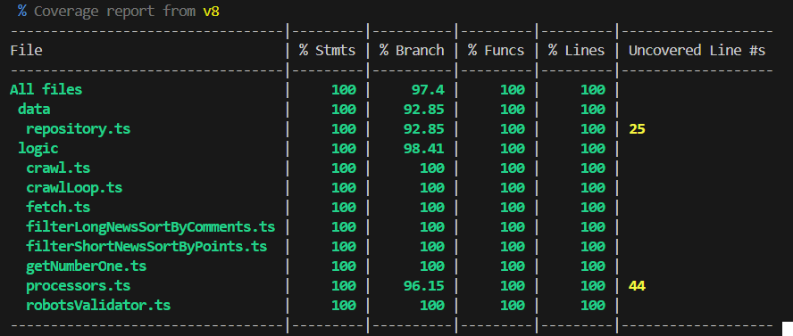

# Hacknews

A **web crawler** CLI built with TypeScript that scrapes news from [Hacker News](https://news.ycombinator.com).

---

## Requirements
- [**Node.js**](https://nodejs.org/) (>v20)  
- [**Git Bash**](https://git-scm.com/downloads/win) (recommended for Windows users)

### Other libraries and technologies
- [TypeScript](https://www.typescriptlang.org/)
- [Commander.js](https://www.npmjs.com/package/commander)
- [jsdom](https://www.npmjs.com/package/jsdom)
- [Vitest](https://vitest.dev/)
- [tsx](https://tsx.is/)

## How to use
### 1. Clone or download the repository:
```bash
git clone https://github.com/rucev/hacknews
````
### 2. Navigate to the project folder:
```bash
cd hacknews
```
### 3. Install dependencies:
```bash
npm i
```

### 4. Build the CLI

```bash
npm run build
npm link # may not be necessary, just if you're having issues
```

### 5. Use any of the available commands

```bash
hacknews --help #-h
hacknews --version #-v

# The following generate .json on the folder ./build/data
hacknews run -m # keeps running, updating the saved data every minute 
hacknews run -h # keeps running, updating the saved data every hour
hacknews long # filters the last registered news by number of words in the title (<5) and sorts them by comments
hacknews short # filters the last registered news by number of words in the title (=>5) and sorts them by points
```

#### Examples of generated .json
- [All entries with a timeStamp](./docs/entries.json)
- [Long title news filtered](./docs/1757102519928-2025-09-05.json)
- [Short title news filtered](./docs/1757102524359-2025-09-05.json)

## Tests & Coverage

Run tests and/or generate coverage reports:

```bash
npm run test
npm run test-coverage
```



## Excluded files:
All the index.ts files have been excluded of testing for one of the following reasons:
- They contain mainly imports of files tested on its own
- They depend greatly of a library already tested by it's development team

## Project Structure

```sh
src/
├── logic/ # Core logics (fetching, filter, loops)
├── interfaces/ # TS interfaces
├── data/  # Data persistence layer (JSON) + repository
└── index.ts # Application entry point (CLI with commander.js)
tests/ # Unit tests (vitest)
```